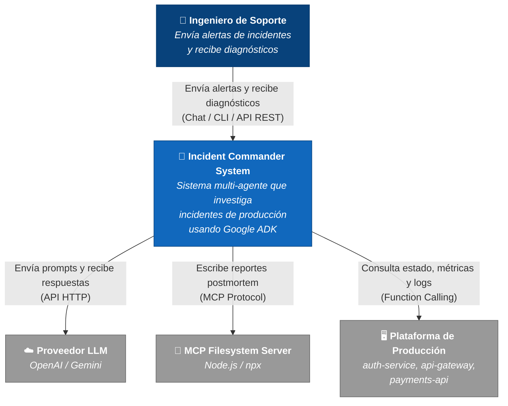
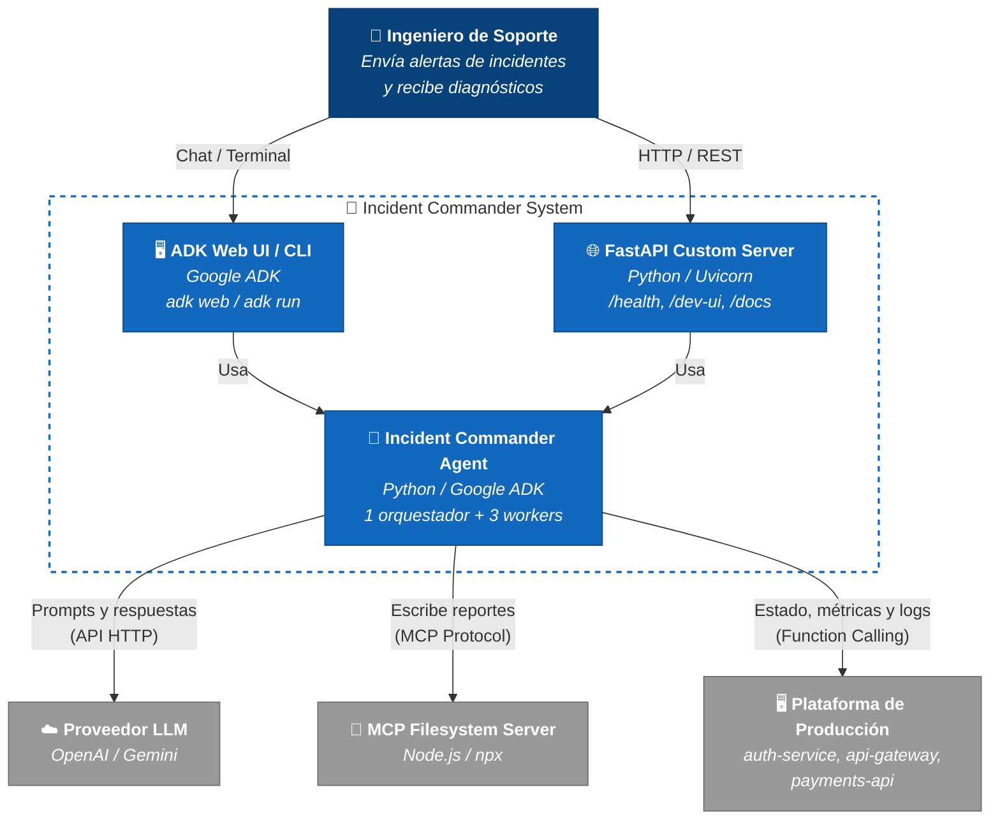
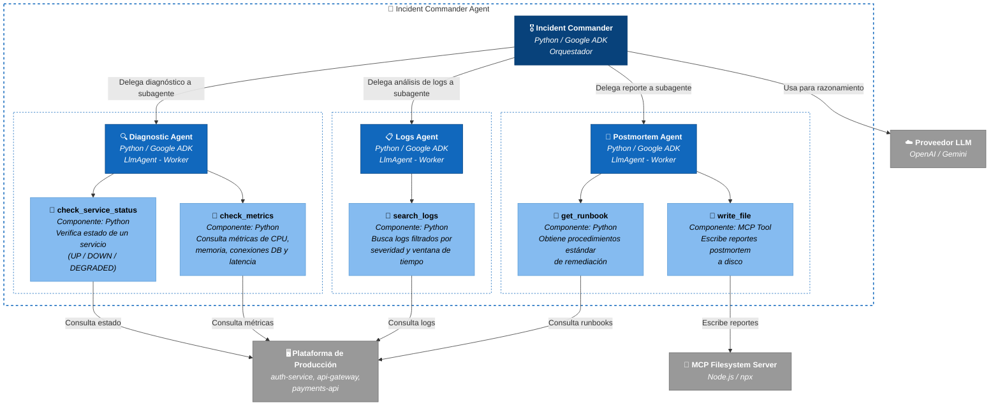

# Incident Commander — Sistema Multi-Agente para Investigación de Incidentes

Sistema multi-agente que simula la respuesta a incidentes de producción. Recibe alertas, investiga problemas usando herramientas especializadas, y genera diagnósticos con reportes escritos a disco.

**Demo principal del workshop "Fundamentos de Ingeniería de IA" - Sesión de Agentes IA.**

## ¿Qué Enseña Este Demo?

| Concepto | Cómo se ve en el demo |
|----------|----------------------|
| **Qué es un agente** | El Commander recibe un objetivo ("investigar el incidente") y decide autónomamente cómo resolverlo |
| **Function calling / Tools** | Cada investigación usa funciones concretas: `check_service_status()`, `search_logs()`, etc. |
| **MCP Tools** | El postmortem_agent escribe reportes a disco usando un servidor MCP de filesystem — la tool no vive en el código del agente |
| **ReAct loop** | En los traces de `adk web`: Thought → Action → Observation → Thought → ... |
| **Multi-agent** | El Commander delega a 3 sub-agentes especializados |
| **Orchestrator-Workers** | El Commander decide dinámicamente qué agente necesita y en qué orden |
| **Multi-modelo** | Configuración centralizada permite cambiar entre diferentes modelos (OpenAI, Gemini) desde una variable de entorno |
| **Configuración centralizada** | Un solo archivo `models.py` gestiona la configuración del modelo para todos los agentes |

**Framework:** Google ADK (Agent Development Kit)  
**Patrón de arquitectura:** Orchestrator-Workers con LLM-based orchestration  
**Modelos:** Configurable via `.env` (por defecto: gpt-5-nano para todos los agentes)

---

## Arquitectura

### Patrón: Orchestrator-Workers

El Incident Commander implementa el patrón **Orchestrator-Workers** de Anthropic. El orquestador (commander) usa su LLM para decidir dinámicamente a qué worker (sub-agent) delegar y en qué orden.

**Diferencia con Prompt Chaining:** El flujo natural del incidente tiende a ser secuencial (diagnosticar → logs → postmortem), pero la secuencia **no está hardcodeada** — el LLM decide. Con prompts vagos, puede cambiar el orden o volver a llamar a un agente.

### Diagramas de Arquitectura - Modelo C4

#### Nivel 1: Diagrama de Contexto



#### Nivel 2: Diagrama de Contenedores



#### Nivel 3: Diagrama de Componentes — Incident Commander Agent



### Agentes

#### 1. **incident_commander** (Orquestador)
- **Modelo:** Configurable via `MODEL_NAME` (default: gpt-5-nano)
- **Rol:** Coordina la investigación del incidente
- **Sub-agentes:** diagnostic_agent, logs_agent, postmortem_agent
- **Protocolo:** TRIAGE → CAUSA RAÍZ → REPORTE → RESUMEN

#### 2. **diagnostic_agent** (Worker)
- **Modelo:** Compartido desde `models.py`
- **Rol:** Especialista en verificar estado de servicios y métricas
- **Tools:**
  - `check_service_status(service_name)` — Verifica estado (UP/DOWN/DEGRADED)
  - `check_metrics(service_name)` — Revisa CPU, memoria, conexiones DB, latencia

#### 3. **logs_agent** (Worker)
- **Modelo:** Compartido desde `models.py`
- **Rol:** Especialista en análisis de logs y patrones de error
- **Tools:**
  - `search_logs(service_name, severity, minutes)` — Busca logs filtrados por severidad y ventana de tiempo

#### 4. **postmortem_agent** (Worker)
- **Modelo:** Compartido desde `models.py`
- **Rol:** Especialista en generar reportes de postmortem estructurados
- **Tools:**
  - `get_runbook(issue_type)` — Obtiene procedimientos estándar (runbooks)
  - `write_file(path, content)` — Escribe reportes a disco (via MCP filesystem server)

---

## Requisitos Previos

- **Python 3.12+**
- **uv** instalado (gestor de paquetes Python moderno)
- **Node.js y npx** (para el MCP filesystem server)
- **API Keys:**
  - Google API Key (para Gemini)
  - OpenAI API Key (para GPT-5-nano)

---

## Configuración

### 1. Navegar al directorio raíz de agentes

```bash
cd agents
```

### 2. Sincronizar dependencias con uv

```bash
uv sync
```

Esto instalará automáticamente:
- `google-adk` - Framework para desarrollo de agentes
- `litellm` - Interfaz unificada para múltiples LLM providers
- Dependencias del MCP server

### 3. Configurar variables de entorno

```bash
cp .env.example .env
```

Edita `.env` con tus API keys y configuración del modelo:

```env
# Model Configuration
MODEL_NAME=gpt-5-nano  # Opciones: gpt-5-nano, gpt-4o-mini, gpt-4o, gemini-2.0-flash, gemini-1.5-flash

# Google AI API Configuration
GOOGLE_GENAI_USE_VERTEXAI=FALSE
GOOGLE_API_KEY=tu-google-api-key-aqui

# OpenAI API Configuration (requerido si usas modelos GPT)
OPENAI_API_KEY=tu-openai-api-key-aqui
```

**Nota sobre modelos:**
- Modelos **OpenAI** (`gpt-*`): Requieren `OPENAI_API_KEY`, se configuran automáticamente con LiteLLM
- Modelos **Gemini**: Requieren `GOOGLE_API_KEY`, se usan directamente
- Todos los agentes usan el mismo modelo configurado en `MODEL_NAME`

---

## Modos de Ejecución

### Opción 1: `adk web` (Recomendado para demos)

Interfaz web interactiva con visualización de traces y eventos:

```bash
cd agents/incident_commander/
adk web
```

Abre el navegador en `http://localhost:8000` (o el puerto indicado). Desde allí:
- Envía mensajes al agente en el chat
- Ve los traces de cada delegación y tool call
- Observa el flujo ReAct en tiempo real

### Opción 2: `adk run` (CLI interactivo)

```bash
cd agents/incident_commander/
adk run incident_commander
```

Conversación interactiva en la terminal.

### Opción 3: `adk api_server` (API REST automática)

```bash
cd agents/incident_commander/
adk api_server
```

Levanta un servidor FastAPI con endpoints REST y WebSocket. API docs en `/docs`.

### Opción 4: `uvicorn main:app` (FastAPI custom)

Servidor FastAPI personalizado con endpoints adicionales:

```bash
cd agents/incident-commander-system/incident_commander/
uvicorn main:app --reload --port 8000
```

Incluye:
- `/health` — Health check endpoint
- `/` — Información del servicio
- `/dev-ui/` — Dev UI de ADK
- `/docs` — API documentation

---

## Ejemplos de Entrada para Demos

### 1. Alerta completa (Demo principal — muestra los 3 sub-agentes)

```
ALERTA CRÍTICA — P1

Servicio afectado: auth-service
Estado: DOWN
Síntoma: Usuarios no pueden hacer login desde las 3:00 PM
Error reportado: HTTP 503 en todos los endpoints de autenticación
Servicios posiblemente afectados: api-gateway

Por favor investiga el incidente, identifica la causa raíz y genera un reporte de postmortem.
```

**Qué demuestra:** Flujo completo del Orchestrator-Workers. El commander delega secuencialmente a los 3 agentes. Se ven todas las tools en acción incluyendo el write_file del MCP.

### 2. Alerta vaga (Muestra razonamiento autónomo)

```
Alerta: Los usuarios están reportando que no pueden hacer login. Parece que algo se cayó.
Investiga qué está pasando.
```

**Qué demuestra:** Autonomía del agente. No le dicen qué servicio revisar ni en qué orden — el commander debe decidir por su cuenta. En los traces se ve el razonamiento del LLM.

### 3. Health check rápido (Demo parcial — solo diagnostic_agent)

```
Necesito un health check rápido de los 3 servicios: auth-service, api-gateway y payments-api.
Dame el estado y las métricas de cada uno.
```

**Qué demuestra:** El commander delega solo al diagnostic_agent. Se ven 6 tool calls. Útil para demos cortos.

### 4. Solo análisis de logs (Muestra delegación específica)

```
Revisa los logs de auth-service de los últimos 30 minutos. Necesito entender
qué pasó y cuándo empezó el problema.
```

**Qué demuestra:** El commander delega solo al logs_agent. Muestra delegación selectiva basada en la tarea.

### 5. Pregunta de seguimiento (Después de entrada 1 o 2)

```
¿Cuál es el impacto actual en los usuarios finales? ¿payments-api está en riesgo?
```

**Qué demuestra:** El agente mantiene contexto de la conversación. Muestra memory/session en ADK.

---

## Estructura del Proyecto

```
incident_commander/
├── __init__.py                  # Convención ADK: from . import agent
├── agent.py                     # Entry point: root_agent = incident_commander
├── models.py                    # Configuración centralizada del modelo
├── prompts.py                   # Prompts del orquestador
├── main.py                      # FastAPI custom (opcional)
├── .env.example                 # Plantilla de configuración
├── .gitignore                   # reports/, .env, __pycache__/, .adk/
├── reports/                     # Reportes generados por MCP
│   └── .gitkeep                 # Mantiene el directorio en git
└── sub_agents/                  # Workers especializados
    ├── diagnostic_agent/
    │   ├── __init__.py          # from . import agent
    │   ├── agent.py             # Define diagnostic_agent
    │   ├── prompts.py           # Prompts del agente
    │   └── tools.py             # Tools: check_service_status, check_metrics
    ├── logs_agent/
    │   ├── __init__.py
    │   ├── agent.py             # Define logs_agent
    │   ├── prompts.py           # Prompts del agente
    │   └── tools.py             # Tools: search_logs
    └── postmortem_agent/
        ├── __init__.py
        ├── agent.py             # Define postmortem_agent (con MCP)
        ├── prompts.py           # Prompts del agente
        └── tools.py             # Tools: get_runbook
```

**Notas de arquitectura:**
- **`models.py`**: Un solo archivo gestiona la configuración del modelo para todos los agentes
- **Imports absolutos**: Los sub-agentes importan con `from incident_commander.models import MODEL`
- **Estructura plana**: Archivos `prompts.py` y `tools.py` en lugar de subdirectorios
- **`sub_agents/`**: Directorio siguiendo la convención de Google ADK (evita conflictos con auto-discovery)

---

## Mock Data

El sistema usa **datos simulados inline** en las tools (no archivos externos):

- **Servicios:** auth-service (DOWN), api-gateway (DEGRADED), payments-api (HEALTHY)
- **Incidente simulado:** Agotamiento del pool de conexiones de BD tras deploy v2.4.1
- **Timeline:** Deploy a las 14:25 → Falla a las 14:58 → "Tiempo actual" simulado: 15:05 (2025-06-15)
- **Causa raíz:** Query `SELECT * FROM sessions WHERE expired=false` no cierra conexiones

---

## Recursos Adicionales

- **Google ADK Docs:** [https://google.github.io/adk-docs/](https://google.github.io/adk-docs/)
- **Anthropic Agent Patterns:** [https://www.anthropic.com/research/building-effective-agents](https://www.anthropic.com/research/building-effective-agents)
- **MCP Documentation:** [https://modelcontextprotocol.io/](https://modelcontextprotocol.io/)
- **Design Document:** `.specs/features/agents/incident-commander/design.md` (en la raíz del repo)

---

## Licencia

Proyecto educativo para el workshop "Fundamentos de Ingeniería de IA".
